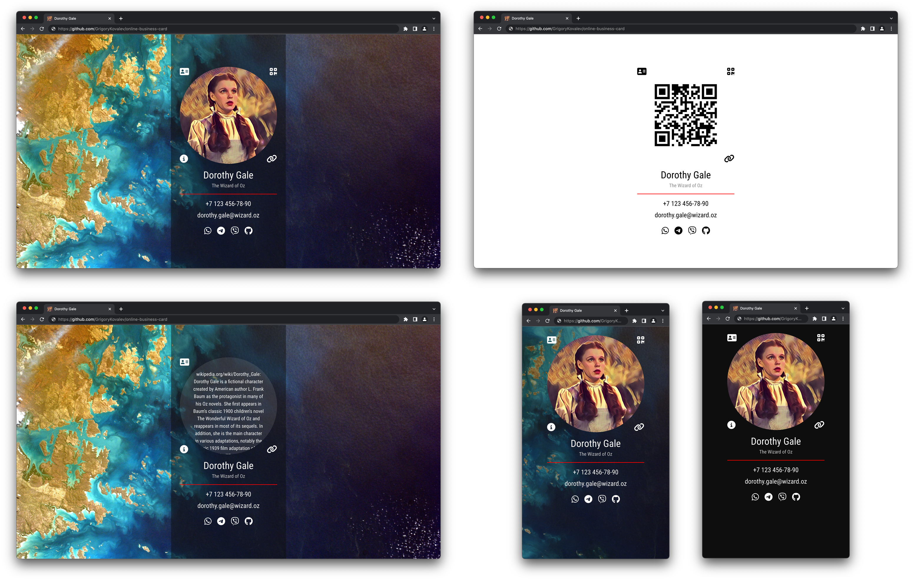

# Онлайн визитка

> На скриншоте показаны: онлайн-визитка, режим просмотра QR-кода, просмотр краткого описания, мобильная онлайн-визитка с фоновым изображением и с фоном черного цвета.

## Описание

Шаблон онлайн визитки, который вы можете изменить и разместить на любом хостинге (например: [GitHub Pages](https://docs.github.com/ru/pages)).

Файлы для базового использования:

- `index.html` - HTML-файл, отображающий вашу визитку.
- `vcard.vcf` - файл в текстовом формате [vCard](https://ru.wikipedia.org/wiki/VCard) для заполнения данными вашей электронной визитки. 
- `avatar.jpg` - аватар для замены на ваше изображение.
- `qrcode.png` - файл QR-кода, содержащий сылку на онлайн визитку, для замены на ваш файл.
- `background.jpg` - фоновое изображение для замены на ваш файл.

## Как пользоваться

[Скачайте](http://github.com/GrigoryKovalev/online-business-card), отредактируйте и разместите.

### 

